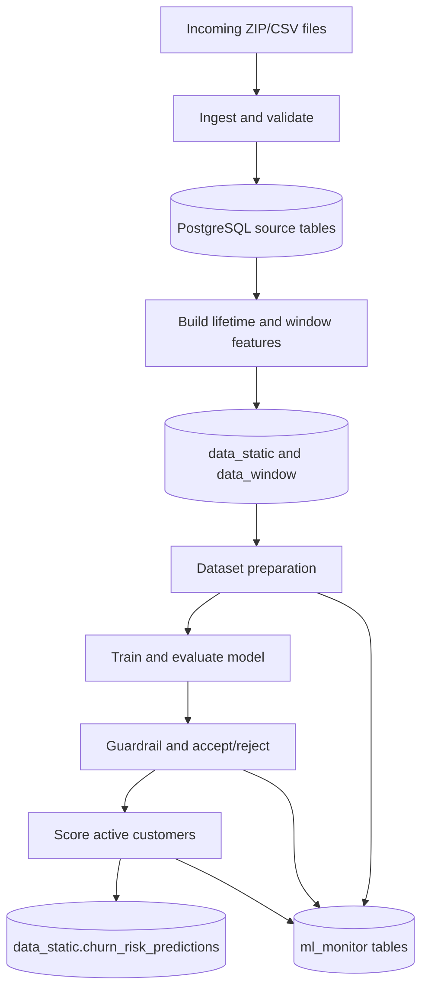

# Data Flow

The pipeline is monthly batch processing. Every stage uses the same temporal
contract: features are built as of `window_end`, labels look forward by the
configured horizon, and scaling is fit on train data only.

## Lifecycle

## Ingestion

`ingest_data` scans the incoming data directory for ZIP files, extracts CSVs,
validates schema, inserts rows into production source tables, and records an
`ingest.ingest_log` entry. Failed files are copied to the failed-data directory
with the original file preserved for retry.

## Feature Engineering

`build_features` constructs customer lifetime features and 1-6 month sliding
window tables in PostgreSQL. Feature SQL is rendered and executed by the feature
engineering package. Runtime paths and images come from Airflow variables or
environment defaults in `dags/runtime_config.py`.

## Dataset Preparation

The dataset pipeline:

- Detects the latest observation month and sets `window_end = T_obs - 1 month`.
- Loads the working customer set as of `window_end` to avoid future activity
  leakage.
- Splits confirmed churn IDs into prototype/train and eval holdout sets.
- Selects walk-forward window size `W*`.
- Builds or loads the leading churn prototype.
- Assigns pseudo labels, sample weights, and smoothed labels.
- Fits the scaler on train rows only, then transforms eval and predict rows.

## Training And Scoring

`run_churn_pipeline` trains XGBoost, evaluates F0.5 and PR-AUC, applies model
quality guardrails, and accepts only candidates that pass the production gate.
If a candidate is rejected, the pipeline scores with the previously accepted
bundle when one exists.

The action list is written to `data_static.churn_risk_predictions` with
`threshold_used`, `window_end`, `w_star`, and `horizon` so CSKH can trace which
model/data window produced each list.

## Monitoring And Retention

Model-quality observability is stored in PostgreSQL under `ml_monitor`: run
logs, score drift, feature drift, and backtests. Infrastructure health remains
in Prometheus/Grafana.

Housekeeping cleans runtime artifacts such as old bundles, logs, saved files,
failed files, and incoming files according to the DAG retention settings.
