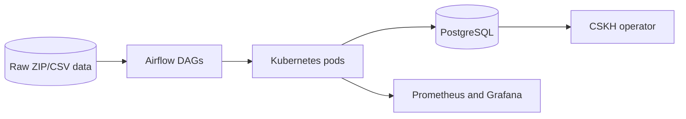
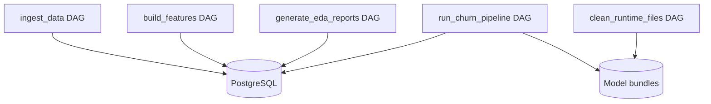

# System Architecture

This project is a batch churn-warning system for B2B delivery customers. It
ingests monthly ZIP/CSV data, builds temporal features in PostgreSQL, trains or
reuses an accepted XGBoost model, and writes a high-precision churn-risk list
for CSKH action.

## Context

## Containers

## Modules

- **Ingestion** scans incoming ZIP files, validates CSV structure, loads source
  tables, logs success/failure, and routes bad files to the failed-data path.
- **Feature engineering** builds lifetime and sliding-window customer features
  in PostgreSQL, using only data available up to the feature window end.
- **Dataset preparation** applies temporal scope rules, confirmed churn labels,
  prototype similarity, PU-style weighting, soft labels, and train-only scaling.
- **Modeling** trains XGBoost, evaluates F0.5 and PR-AUC, applies guardrails,
  accepts or rejects a bundle, and can score with the previous accepted bundle.
- **Monitoring** stores model-quality run logs, score drift, feature drift, and
  backtest results in PostgreSQL. Prometheus/Grafana cover infrastructure health.
- **Operations** uses Airflow KubernetesPodOperator tasks, Docker images, Helm
  values, Kubernetes secrets, and host-mounted churn data for local deployment.

## Technology Stack

- Python modular monolith packaged under `src/`
- PostgreSQL for source tables, features, predictions, config, and monitoring
- XGBoost and scikit-learn for model training and preprocessing
- Airflow with KubernetesPodOperator for isolated heavy jobs
- Docker, kind/Kubernetes, Helm values, Prometheus, and Grafana for local ops

## Accepted Trade-offs

- The system is batch-first. There is no real-time prediction API in the current
  implementation; CSKH consumes `data_static.churn_risk_predictions`.
- Model-quality dashboards are stored as database tables, while Grafana is used
  for infrastructure metrics.
- The project remains a modular monolith to keep deployment and portfolio review
  simple while preserving clear package boundaries.
